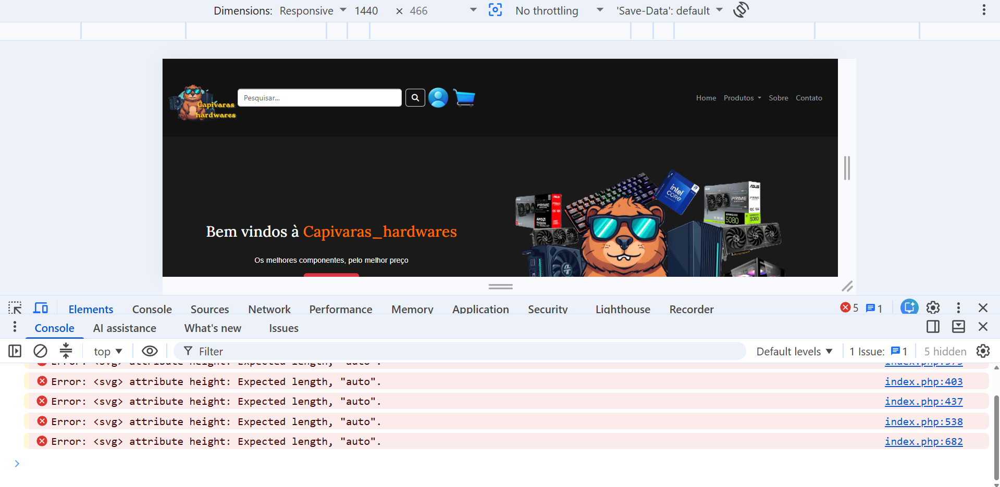

# Capivaras Hardwares

Site de e-commerce fictício de hardwares, desenvolvido como projeto de estudo, aplicando HTML, CSS, PHP e Bootstrap.

## Sobre o projeto

O Capivaras Hardwares é uma loja virtual voltada para venda de componentes de computador, como CPUs, placas gráficas, memórias e periféricos. 

## Tecnologias utilizadas

- HTML5
- CSS3
- PHP
- Bootstrap 5.3.8
- Bootstrap Icons
- Font Awesome
- Google Fonts (Lora, Caveat, Montserrat)
- JavaScript
- Git e GitHub para versionamento

## Funcionalidades

- Layout responsivo, seguindo abordagem mobile first
- Cabeçalho e rodapé reaproveitados entre páginas via include do PHP
- Carrossel de produtos em destaque
- Listagem de produtos por categoria
- Página de login
- Paleta de cores centralizada através de variáveis CSS

## Durante o desenvolvimento

- Ao copiar os ícones SVG prontos (formas de pagamento), eles vinham com atributos de `height` e `width` e outros atributos herdados dos softwares que os gerou no próprio código, tipo `height="auto"`. Isso pode gerar conflito com o CSS que já estava controlando o tamanho desses ícones. A solução foi remover esses atributos direto do código SVG e deixar o tamanho só por conta do CSS.

## Autor

Elvis Travisani